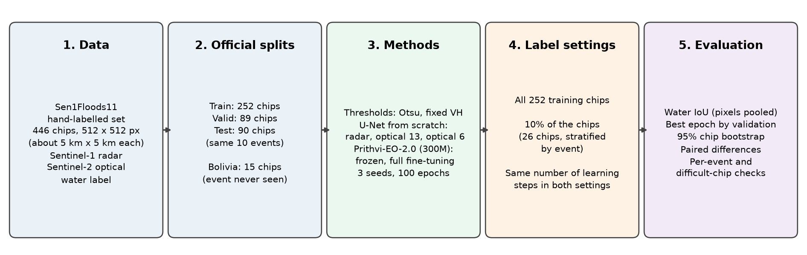
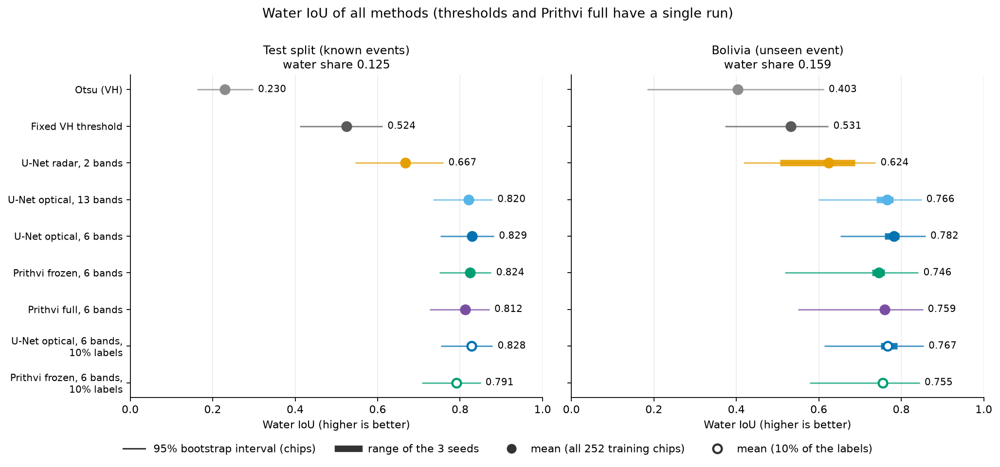
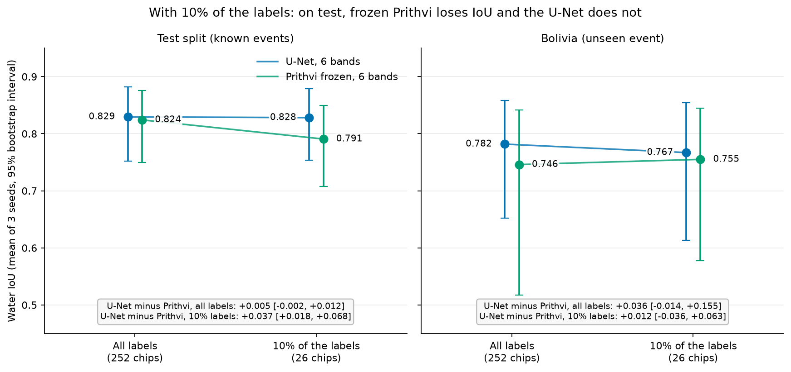
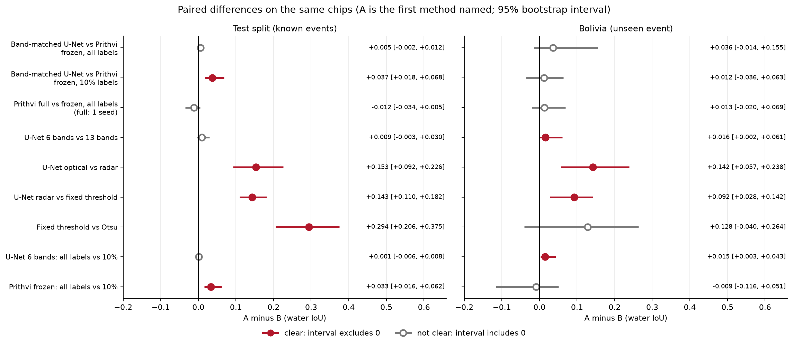
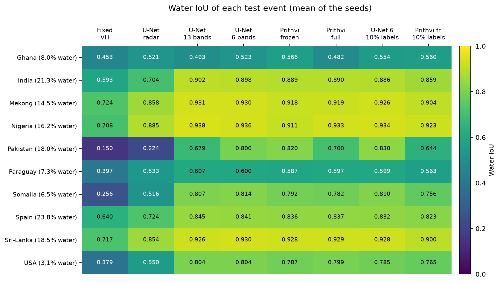
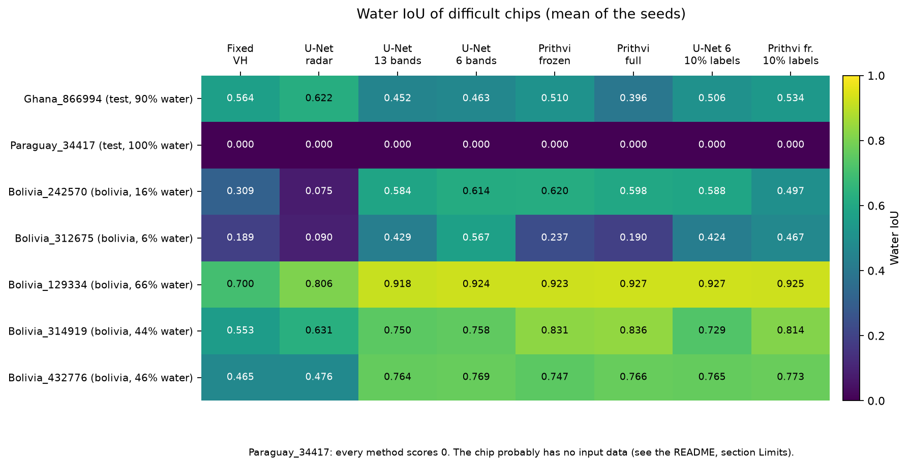

# FloodFM-Sen1Floods11

**Does a satellite foundation model map floods better than a U-Net trained from scratch? On a flood event it has never seen, and with few labels?**

This project compares IBM and NASA's **Prithvi-EO-2.0** foundation model (used through TerraTorch) with U-Nets trained from zero, on the hand-labelled part of the **Sen1Floods11** flood dataset (Sentinel-1 radar and Sentinel-2 optical images). All comparisons use the same data, the same official splits, the same scores, 3 seeds, and bootstrap intervals.

The project is a small, controlled test. It is not a research paper.

Author: Parham Imanzadeh Charandabi. Contact: pimanzadeh.ch@gmail.com

**Full report:** [reports/Final_Report.md](reports/Final_Report.md). Reports of each stage are in the same folder.



---

## 1. Short answer

All numbers are water IoU. "Paired difference" compares two methods on the same random lists of chips (95% bootstrap interval in brackets). If the interval includes 0, the difference can be chance.

| Question | Result |
|---|---|
| **All labels, known events (test).** Frozen Prithvi against a U-Net on the same 6 bands. | 0.824 against 0.829. Paired difference +0.005 [-0.002, +0.012]. **Not clear.** |
| **All labels, new event (Bolivia).** Same models. | 0.746 against 0.782. Paired difference +0.036 [-0.014, +0.155]. **Not clear.** The interval is wide, because Bolivia has only 15 chips. There is no evidence that Prithvi generalises better, and no evidence that it generalises worse. |
| **10% of the labels (26 of 252 training chips), test.** | Prithvi 0.791, U-Net 0.828. Paired difference +0.037 [+0.018, +0.068]. **The U-Net is better.** |
| **10% of the labels, Bolivia.** | Prithvi 0.755, U-Net 0.767. Paired difference +0.012 [-0.036, +0.063]. **Not clear.** |
| **What fewer labels cost (252 chips minus 26 chips), test.** | U-Net +0.001 [-0.006, +0.008]: nothing detectable. Frozen Prithvi +0.033 [+0.016, +0.062]: a clear loss. |
| **Full fine-tuning against frozen backbone.** | Not clear on test or on Bolivia. Full fine-tuning has one seed only. |
| **Optical against radar (U-Net).** | Optical is clearly better: +0.153 [+0.092, +0.226] on test and +0.142 [+0.057, +0.238] on Bolivia. The labels were made with the optical images, which favours optical. |
| **Deep models against simple thresholds.** | On test, all deep models are clearly above the best threshold (0.524). On Bolivia, the radar U-Net is above the fixed threshold on average (+0.092 [+0.028, +0.142]), but one radar seed (0.507) was below it. |

**In this setup, frozen Prithvi did not need fewer labels than a U-Net trained from zero.** This result is for one dataset, one set of training settings, one 10% subset of chips, and a frozen backbone. It does not say anything about other foundation models or other datasets.







---

## 2. Data

**Sen1Floods11, version 1.1** (Bonafilia et al., 2020). Only the **446 hand-labelled chips** are used.

| Item | Value |
|---|---|
| Chip | One 512 x 512 pixel square. One pixel is about 10 m. One chip covers about 5 km x 5 km. |
| Files for each chip | Sentinel-1 radar (2 bands, VV and VH, in dB), Sentinel-2 optical (13 bands), water label |
| Label values | 1 = water, 0 = not water, -1 = no data (not used for training or scores) |
| Flood events | 11 events in 11 regions |

| Split | Chips | Purpose |
|---|---|---|
| Train | 252 | Training |
| Valid | 89 | Selection of the best epoch |
| Test | 90 | Final score on **known events** (the same 10 events as in training) |
| Bolivia | 15 | Final score on **one event that is never used in training** |

The official split files are used. No own split was made.

**Properties of the labels that affect the results:**

- The labels show **all water** (rivers, lakes, sea and flood water), not only flood water.
- The experts made the labels from a Sentinel-2 water map, the Sentinel-1 VH band and two Sentinel-2 colour images. This favours models that use Sentinel-2.
- Many chips have large areas with no data. Scores and water shares use only pixels with the label 0 or 1.

Source: https://github.com/cloudtostreet/Sen1Floods11 (storage: `gs://sen1floods11/v1.1`).

---

## 3. Methods

| Method | Type | Input | Pretrained? |
|---|---|---|---|
| Otsu threshold | One threshold for each chip, no labels used | Radar VH | No |
| Fixed VH threshold | One threshold for all chips, chosen on the training chips (-23.6 dB) | Radar VH | No |
| U-Net radar | ResNet-34 encoder, random start | Radar, 2 bands | No |
| U-Net optical 13 | Same model | Optical, 13 bands | No |
| U-Net optical 6 | Same model | Optical, the 6 bands of Prithvi | No |
| Prithvi frozen | Prithvi-EO-2.0-300M-TL backbone fixed; necks, UNet decoder and head learn (20.3 M of 324 M weights) | Optical, 6 bands | Yes |
| Prithvi full | The same model, all weights learn | Optical, 6 bands | Yes |

**The 6 bands of Prithvi:** Sentinel-2 B2 (blue), B3 (green), B4 (red), B8A (narrow near infrared), B11 and B12 (shortwave infrared).

**Why a U-Net on 6 bands:** Prithvi sees 6 bands. A U-Net on 13 bands sees more information. The 6-band U-Net makes the main comparison fair.

| Setting | U-Net | Prithvi |
|---|---|---|
| Library | segmentation-models-pytorch | TerraTorch 1.2.13 |
| Loss | Cross-entropy + Dice | Dice |
| Optimiser | AdamW, learning rate 0.001, weight decay 0.0001 | AdamW, learning rate 0.0001, weight decay 0.1 |
| Learning-rate schedule | Cosine | Halved after 5 epochs without improvement of the validation loss |
| Augmentation | Random flips | Random flips and 90 degree turns (D4) |
| Epochs, batch | 100, 8 | 100, 8 (full fine-tuning: 2 x 4 chips with gradient accumulation) |
| Precision | 16-bit mixed | 16-bit mixed |

Each model uses the settings of its own source. No setting was tuned. The Prithvi settings follow the TerraTorch 1.x example configuration from the Prithvi team, because the NASA configuration file does not run on TerraTorch 1.2.13.

**Rules that are the same for all methods:** the same official splits, 3 seeds (0, 1, 2), the best epoch chosen by validation IoU, evaluation on full 512 x 512 chips, and the same missing-input rule (a pixel without input data is predicted as "not water").

### The label-fraction test

Both models (Prithvi frozen and the 6-band U-Net) were also trained with **only 26 of the 252 training chips** (about 10%).

- The 26 chips are chosen once, **stratified by event** (about 10% of each event, at least one chip), with a fixed random number. Both models and all seeds use the same 26 chips.
- Each epoch still has **252 samples**, so the number of learning steps is the same as with all labels (3,100). The 26 chips are drawn again and again with new random flips or turns. Thus only the number of **labelled chips** changes.
- The validation, test and Bolivia chips do not change.

---

## 4. How the results are measured

- **Water IoU** = TP / (TP + FP + FN), where TP is correct water, FP is a false alarm, and FN is missed water. Correct land pixels are not counted, so a model cannot get a high score by predicting "no water". Accuracy is not used for this reason.
- **Pixels are added first.** TP, FP and FN of all chips of a group are added. Then one IoU is calculated. (A chip without water has an IoU of 0 divided by 0.)
- **Water share** is the part of the scored pixels that is water. It is given next to the scores, because a score has a different meaning when the water share is different.
- **Seeds:** each trained model has 3 seeds. The tables give the mean and the range.
- **95% chip bootstrap:** 10,000 random lists of chips (drawn with replacement). For each list, the IoU is calculated again. The middle 95% of the values is the interval.
- **Paired differences:** two methods are compared on the **same** random lists. This is more exact than comparing two separate intervals.

---

## 5. Results

Tables are written by `scripts/make_tables.py` from `results/final_results.csv` and `results/paired_differences.csv`.

### 5.1 Test split (90 chips, water share 0.125)

| Method | Seeds | Water IoU | 95% interval | Seed range |
|---|---|---|---|---|
| Otsu (VH) | 1 | 0.230 | 0.162 to 0.298 | - |
| Fixed VH threshold | 1 | 0.524 | 0.411 to 0.612 | - |
| U-Net radar, 2 bands | 3 | 0.667 | 0.545 to 0.760 | 0.663 to 0.673 |
| U-Net optical, 13 bands | 3 | 0.820 | 0.735 to 0.879 | 0.816 to 0.828 |
| U-Net optical, 6 bands | 3 | 0.829 | 0.752 to 0.882 | 0.827 to 0.832 |
| Prithvi frozen, 6 bands | 3 | 0.824 | 0.750 to 0.876 | 0.822 to 0.826 |
| Prithvi full, 6 bands | 1 | 0.812 | 0.726 to 0.871 | - |
| U-Net optical, 6 bands, 10% labels | 3 | 0.828 | 0.754 to 0.879 | 0.825 to 0.833 |
| Prithvi frozen, 6 bands, 10% labels | 3 | 0.791 | 0.708 to 0.850 | 0.788 to 0.793 |

### 5.2 Bolivia (15 chips, water share 0.159)

| Method | Seeds | Water IoU | 95% interval | Seed range |
|---|---|---|---|---|
| Otsu (VH) | 1 | 0.403 | 0.184 to 0.612 | - |
| Fixed VH threshold | 1 | 0.531 | 0.372 to 0.623 | - |
| U-Net radar, 2 bands | 3 | 0.624 | 0.418 to 0.738 | 0.507 to 0.688 |
| U-Net optical, 13 bands | 3 | 0.766 | 0.599 to 0.849 | 0.740 to 0.781 |
| U-Net optical, 6 bands | 3 | 0.782 | 0.652 to 0.859 | 0.760 to 0.795 |
| Prithvi frozen, 6 bands | 3 | 0.746 | 0.518 to 0.842 | 0.729 to 0.760 |
| Prithvi full, 6 bands | 1 | 0.759 | 0.549 to 0.852 | - |
| U-Net optical, 6 bands, 10% labels | 3 | 0.767 | 0.613 to 0.854 | 0.750 to 0.791 |
| Prithvi frozen, 6 bands, 10% labels | 3 | 0.755 | 0.578 to 0.844 | 0.753 to 0.758 |

**How to read the tables.** The Bolivia intervals are much wider than the test intervals, because Bolivia has only 15 chips. Overlapping intervals do not prove that two methods are equal. Use the paired differences.

### 5.3 Paired differences

| Comparison (A against B) | Split | A minus B | 95% interval | Result |
|---|---|---|---|---|
| Band-matched U-Net vs Prithvi frozen, all labels | test | +0.005 | -0.002 to +0.012 | not clear |
| Band-matched U-Net vs Prithvi frozen, all labels | bolivia | +0.036 | -0.014 to +0.155 | not clear |
| Band-matched U-Net vs Prithvi frozen, 10% labels | test | +0.037 | +0.018 to +0.068 | A better |
| Band-matched U-Net vs Prithvi frozen, 10% labels | bolivia | +0.012 | -0.036 to +0.063 | not clear |
| Prithvi full vs frozen, all labels (full: 1 seed) | test | -0.012 | -0.034 to +0.005 | not clear |
| Prithvi full vs frozen, all labels (full: 1 seed) | bolivia | +0.013 | -0.020 to +0.069 | not clear |
| U-Net 6 bands vs 13 bands | test | +0.009 | -0.003 to +0.030 | not clear |
| U-Net 6 bands vs 13 bands | bolivia | +0.016 | +0.002 to +0.061 | A better |
| U-Net optical vs radar | test | +0.153 | +0.092 to +0.226 | A better |
| U-Net optical vs radar | bolivia | +0.142 | +0.057 to +0.238 | A better |
| U-Net radar vs fixed threshold | test | +0.143 | +0.110 to +0.182 | A better |
| U-Net radar vs fixed threshold | bolivia | +0.092 | +0.028 to +0.142 | A better |
| Fixed threshold vs Otsu | test | +0.294 | +0.206 to +0.375 | A better |
| Fixed threshold vs Otsu | bolivia | +0.128 | -0.040 to +0.264 | not clear |
| U-Net 6 bands: all labels vs 10% | test | +0.001 | -0.006 to +0.008 | not clear |
| U-Net 6 bands: all labels vs 10% | bolivia | +0.015 | +0.003 to +0.043 | A better |
| Prithvi frozen: all labels vs 10% | test | +0.033 | +0.016 to +0.062 | A better |
| Prithvi frozen: all labels vs 10% | bolivia | -0.009 | -0.116 to +0.051 | not clear |

### 5.4 Per event and difficult chips



- With all labels, the 6-band U-Net is better than frozen Prithvi in 8 of 10 test events. Prithvi is better in Ghana and Pakistan.
- With 10% of the labels, the U-Net is better in 9 of 10 events. The largest gap is in Pakistan (0.830 against 0.644). The 10% subset keeps only 2 of the 16 Pakistan training chips.
- Pakistan is very hard for the radar methods (fixed threshold 0.150, U-Net radar 0.224) and much easier for the optical models.



- `Ghana_866994` (90% water): the radar methods score better than the optical models.
- `Bolivia_312675` (6% water) has the largest difference between the models. It explains much of the wide Bolivia interval.

---

## 6. Limits

1. **The labels favour optical models**, and they show all water, not only flood water.
2. **Bolivia has 15 chips from one event.** Small differences (below about 0.05) are usually hidden by the wide intervals. The test split uses the same events as training, so it does not test a new place.
3. **Different training settings** for the two model families (loss, schedule, augmentation, normalisation). Each follows its own source. No setting was tuned.
4. **The label-fraction test** uses one fraction (10%), one subset of chips, and a frozen backbone. A 25% test was dropped because of the free GPU limit.
5. **All 89 validation chips** were used to choose the best epoch, also in the 10% setting. A real user with few labels would not have such a large labelled validation set.
6. **Prithvi full fine-tuning has one seed** and needed gradient accumulation (2 x 4 chips) to fit in the 15.6 GB memory of the T4 GPU.
7. **The bootstrap does not include** the chance from the seeds, from the choice of the 10% subset, or from chips of the same event that belong together. The same Prithvi seed gave results that differ by up to 0.008 on Bolivia between two GPU runs, so differences below about 0.01 between methods are within the noise.
8. **One test chip has no usable input (probably).** On `Paraguay_34417` (50,026 scored pixels, all labelled water) every method scores 0, also the optical models. This points to a chip without Sentinel-1 and Sentinel-2 data. About 2% of the test water pixels are lost for all methods. [Check pending: see the handoff report.]
9. **The scores cannot be compared with the scores in the Sen1Floods11 paper.** That paper uses a different model and the mean of the IoU of each chip. This project adds the pixels first.
10. **One dataset only.**

**Data handling note.** After the label-fraction runs, three results files were missing on Google Drive because of a file-sync problem. A wrong recovery attempt was deleted, and the three runs were trained again. All numbers in this README come from the second runs.

---

## 7. How to reproduce

**Environment used:** Google Colab (free tier), Tesla T4 GPU with 15.6 GB, Python 3.13, PyTorch 2.11.0 (CUDA 13.0 build), TerraTorch 1.2.13, numpy 2.5.3. The version of segmentation-models-pytorch was not recorded.

| Step | Notebook or script | What it does | Runtime |
|---|---|---|---|
| 0 | `notebooks/00_setup.ipynb` | Mounts Drive, makes the folders, downloads the 446 chips and the 4 split files with `gsutil rsync` from `gs://sen1floods11/v1.1`, checks the files | CPU or GPU |
| 1 | `notebooks/01_explore_chip.ipynb` | Looks at chips; label statistics | CPU |
| 2 | `notebooks/02_otsu_baseline.ipynb` | Otsu and fixed-threshold baselines; training-split statistics (`norm_stats.json`) | CPU |
| 3 | `notebooks/03_unet.ipynb` | U-Net on radar and on optical; 3 seeds each | GPU, about 1 h 40 min |
| 4 | `notebooks/04_prithvi.ipynb` | Prithvi frozen (3 seeds), Prithvi full (1 seed), label-fraction test; the 6-band U-Net runs are in `03_unet.ipynb` (Cell 11) | GPU, many hours |
| 5 | `notebooks/05_analysis.ipynb` | Bootstrap, paired differences, tables | CPU |
| 6 | `scripts/make_figures.py`, `scripts/make_tables.py` | Figures and README tables from `results/*.csv` | CPU |

Approximate time for one epoch on the T4: U-Net radar 10 s, U-Net optical 13 bands 13 s, U-Net 6 bands 17 s, Prithvi frozen 31 s, Prithvi full 65 s. All runs save a checkpoint after each epoch and continue after a stop.

**Rules for Colab:**

1. Run `drive.flush_and_unmount()` at the end of a long session. Colab saves files to Drive in the background, and files can be lost when the server stops.
2. Check in the Drive folder (in the browser) that each new results file exists.
3. Before a re-evaluation, print the epoch of the checkpoint and compare it with the training log.

---

## 8. Repository layout

```
src/floodfm/       data.py, dataset.py, metrics.py, baselines.py, train.py, evaluate.py, prithvi.py
notebooks/         00_setup ... 05_analysis
scripts/           make_figures.py, make_tables.py, make_bolivia_panels.py
reports/           Final_Report.md and the reports of Stages 0 to 5
results/           4 CSV tables (final_results, paired_differences, per_event_test, difficult_chips),
                   21 results files (JSON, counts of each chip), norm_stats.json, subset_frac10.json
figures/           fig0 ... fig5
```

Data files, checkpoints and image files are not in the repository (see `.gitignore`). They stay on Google Drive.

---

## 9. Sources

- Sen1Floods11 dataset: https://github.com/cloudtostreet/Sen1Floods11
- Bonafilia, D., Tellman, B., Anderson, T., Issenberg, E. (2020). Sen1Floods11: A Georeferenced Dataset to Train and Test Deep Learning Flood Algorithms for Sentinel-1. CVPR Workshops. https://openaccess.thecvf.com/content_CVPRW_2020/papers/w11/Bonafilia_Sen1Floods11_A_Georeferenced_Dataset_to_Train_and_Test_Deep_Learning_CVPRW_2020_paper.pdf
- Prithvi-EO-2.0-300M-TL fine-tuned on Sen1Floods11 (model card): https://huggingface.co/ibm-nasa-geospatial/Prithvi-EO-2.0-300M-TL-Sen1Floods11
- NASA configuration (does not run on TerraTorch 1.2.13): https://github.com/NASA-IMPACT/Prithvi-EO-2.0/blob/main/configs/sen1floods11.yaml
- TerraTorch 1.x example configuration used here: https://github.com/blumenstiel/TerraTorch-Examples/blob/main/configs/prithvi_v2_eo_300_tl_unet_sen1floods11.yaml
- TerraTorch documentation: https://ibm.github.io/terratorch

---

## 10. Contact

pimanzadeh.ch@gmail.com
